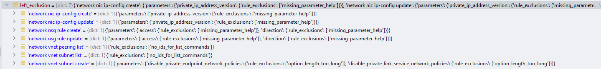

exclusions = left_exclusion
for path in selected_mod_paths:
    module_exclusion_paths = os.path.join(path, 'linter_exclusions.yml')
global_exclusion_paths = ['C:\\code\\azure-cli\\linter_exclusions.yml', 'C:\\code\\azure-cli-extensions']
with self.command_group('vmss rolling-upgrade', compute_vmss_rolling_upgrade_sdk, min_api='2017-03-30') as g:

for scope in ['vm unmanaged-disk attach', 'vm unmanaged-disk detach']:
    with self.argument_context(scope) as c:

with self.argument_context('vm unmanaged-disk detach') as c: