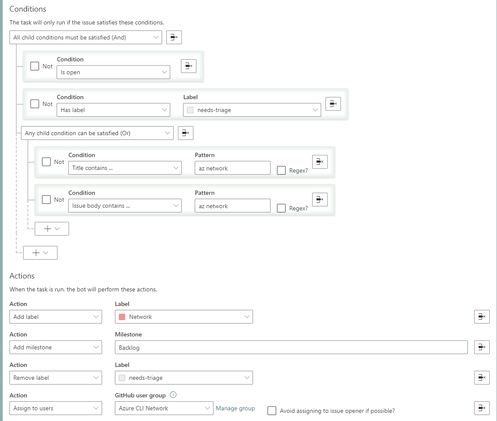

1. 如果同时使用了 Config-as-code 和 Fabric Bot configuration portal, 并且配置冲突了，哪个的优先级更高?会有什么问题？
2. Config-as-code 和 Fabric Bot configuration portal 支持的功能是一样的嘛？
3. 一个 task 内能否不同的conditions 对应不同的 actions, 现在一对一的模式 task 太多很难维护， 需要举例

【时间参数的支持】
3. Auto assign milestone based on issue creation date. 
4. Auto assign milestone based on PR creation date.
5. Notify PR creators when the PR created cannot be released in this sprint (created in the last week of the sprint)

6. discuss Notify PR creator when CI fail. 能否获取到CI任务的执行状态，并以此为触发条件，触发对应的actions.
7. Verify PR title, history notes to make it more standard to reduce manual effort during release. 需要支持更加复杂的条件和分支
   以及在不同的分支下，有不同的actions

8. actions 能否支持邮件通知选项。
9. Config-as-code 权限安全问题。

Hi Fabricbotservices,
There are a few questions to confirm when we use fabric bot
1. Can we use both Config-as-code and Fabric-bot-configuration-portal ?
2. If the answer of Q1 is yes, and the config is conflict, which one will take effect ?
3. Can fabric bot support different conditions correspond to different actions in one task.
   For example, our project has dozens of modules, 
   and we need to automatically distribute to different people for processing according to the title and content of the issue and PR.
   Now to achieve this function, we need to configure hundreds of very similar tasks like the picture, which is difficult to maintain.
   Is there a way we can config all this in one task?
   
4. Can fabric bot support some time-related functions, we want add some tasks, their actions is based on time. 
   Do you have any idea how can we config these tasks in fabric bot
   Auto assign milestone based on issue creation date.
   Auto assign milestone based on PR creation date.
   Notify PR creators when the PR created cannot be released in this sprint (For example: created in the last week of the sprint)