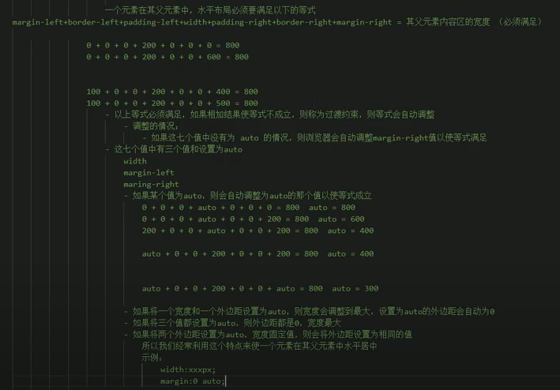
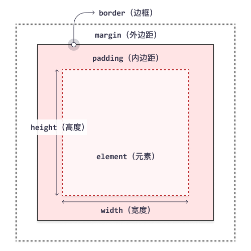

网页表现
CSS 层叠样式表

引入方式：
```html
1. 内联样式 p[style=""]
<p style="color:red; font-size: 60px;">aaa</p>
2. 内部样式表 html>head>style
<html><head><style></style></head></html>
3. 外部样式表
<link rel="stylesheet" href="">
``` 

CSS 注释： /* */

选择器关系
1. 父元素：直接包含子元素的
2. 子元素：直接被父元素包含的
3. 祖先元素：直接或间接包含后代元素的，父元素也是祖先元素
4. 后代元素：直接或间接被祖先元素包含的，子元素也是后代元素
5. 兄弟元素：拥有相同父元素的

CSS 选择器
[css selectors](https://github.com/flukeout/css-diner)
1. 直接选取所有指定元素
2. id 选择器 `#id{}` 唯一
3. class 选择器 `.class{}` 可以重复, 多个 class 使用空格分隔
4. 通配选择器 `*{}`
5. 交集选择器 `选择器1选择器2选择器3{}` eg: `div.red{} a.b.c{}`
6. 并集选择器 `选择器1,选择器2{}`
7. 父子选择器 `父 > 子`
8. 后代选择器 `祖先 后代`
9. 兄弟元素选择器：只能后顾 无法前瞻
  - 下一个兄弟：`兄 + 弟` eg: `p + span{}`
  - 选择所有兄弟： `兄 ~ 弟` 
10. 属性选择器：
  - `[attr]`
  - `[attr=value]`
  - `[attr^=value]` 选择属性值以value开头的
  - `[attr$=value]` 结尾
  - `[attr*=value]` 包含
11. 伪类选择器：
伪类即某个特殊状态的类，比如：第一个、被点击的、偶数的、鼠标移入的元素  
伪类是根据所有子元素进行排序的
  - :xxx 伪类
    - 不同类型
      - :only-child select any element that is the only element inside if another one.
      - :first-child
      - :last-child
      - :nth-last-child() like nth-child, but counting from the back!
      - :nth-child()
        - :nth-child(\d) 选中第n个
        - :nth-child(n) 全选
        - :nth-child(2n) or :nth-child(even) 偶数
        - :nth-child(2n+1) or :nth-child(odd) 奇数
    - 同类型中
      - :only-of-type select the only element of its type within another element.
      - :first-of-type 
      - :last-of-type 
      - :nth-of-type()
        - plate:nth-of-type(2n+3) select every 2nd plate, starting from the 3rd.
    - :not() 否定伪类
      - ul > li:not(:nth-child(3)){} : ul 子元素中除了第三个的所有 li
    - :link 没访问过的链接
    - :visited 访问过的链接，**由于隐私原因，visited 只支持改链接颜色**
    - :hover 鼠标移入
    - :active 鼠标点击
    - :focus 获得焦点的元素
    - :empty select elements that don't have any other elements inside of them.
12. 伪元素选择器：
伪元素即页面中特殊位置的元素
  - ::xxx
  - ::first-letter 第一个字母
  - ::first-line 第一行
  - ::selection 鼠标选中的内容
  - ::before 元素的开始 ::after 元素的结束
    - 必须结合content使用
    - 实际案例： <q></q> 加上的引号 
13. 选择器的权重 high -> low
    - !important 获取到最高优先级！
    - 内联样式
    - id选择器
    - 类和伪类选择器
    - 元素选择器
    - 通配选择器
    - 继承样式

样式继承
1. 为一个元素设置的样式会应用到它的后代元素上。
2. 把统一样式设置到共同的祖先上。
3. 背景相关，布局相关不会继承。 eg: background-color

单位
1. px：像素点，同样的200px在高清屏下会自动放大，所以显示效果不一样。
2. %：百分比，默认相对父元素的百分比。
3. em: 根据字体大小计算，1em = 1font-size, 默认16px。
4. rem：根据root元素的字体大小计算。
5. RGB：red/green/blue 浓度调配，取值 0-255 或 0%-100%。rgb(r,g,b,x)
   x 代表透明度, 0 全透明 1 不透明。
6. RGB 16 进制 #ff0000 -> 255,0,0 -> 简写：#f00
7. HSL: HSLA hsl(0, saturation, lightness);
   - H色相 0-360度，代表颜色 
   - S饱和度 颜色浓度 0-100 **%**
   - L亮度 0-100 **%** 

**文档流 normal flow**
- 网页是多层结构，最底下的一层称为文档流，创建的元素默认在文档流中排列。
- 文档流中元素的特点：
  - 块元素独占一行（自上向下垂直排列)，默认宽度是父元素宽度，默认高度是内容宽度（子元素）
  - 行内元素在页面中自左向右水平排列，超出一行自动换行排列，等同书写习惯，默认高度和宽度都由内容决定。

**盒子模型 box model**
- 四个值：上右下左；
- 三个值：上 左右 下；
- 两个值：上下 左右；
- 一个值：上下左右  
- CSS 将页面中的所有元素都设置为了矩形盒子  
- 每一个盒子都由：内容 content，内边距 padding，边框 border，外边距 margin 组成。  
  - content：width，height  
  - border：border-width，border-color，border-style，border-[top,right,bottom,left]-width  
    - solid 实线
    - dotted 点状虚线
    - dashed 虚线
    - double 双线
    - border 简写： border: 10px solid red;
  - padding: 
    - padding-[top,right,bottom,left]
  - margin:
    - 外边距不会影响盒子大小，但是会影响盒子位置。
    - top,left 自身移动； bottom,right 移动其他元素。
    - margin-[top,right,bottom,left]
- 水平布局 由一下属性共同决定
  - margin-left
  - border-left
  - padding-left
  - width
  - padding-right
  - border-right
  - margin-right  
  
    
- 垂直布局
  - 默认父元素高度被子元素撑开
  - 指定父元素高度后，父元素高度固定，overflow属性决定如何处理溢出的子元素
  - overflow: 
    - [visible(default),hidden,scroll,auto] auto 根据需要自动生成滚动条
    - 单独处理某一个方向: overflow-x, overflow-y 
- 外边距的折叠: 
  - 相邻的垂直方向的外边距会发生折叠现象。
  - .box1{marigin-bottom: 100px;}
  - .box2{marigin-top: 100px;}
  - 兄弟元素：
    - 都是正值取最大值
    - 一正一负取和
    - 都是负值取绝对值最大值
  - 父子元素
    - 父子元素相邻外边距，子元素会传递给父元素（上外边距）**必须处理**
    - 改用padding-top，同时父元素height需要调整。
    - 父元素设置border-top，同时调整height。（border 0px不行吗？ TODO）
- 行内元素的盒子模型
  - 不支持设置宽度和高度。
  - 行内元素可以设置padding，但是垂直方向不会影响布局，即会发生隐藏和遮挡。
  - 行内元素可以设置border，但是垂直方向不会影响布局，即会发生隐藏和遮挡。
  - 行内元素可以设置margin，但是垂直方向不会影响布局，即会发生隐藏和遮挡，且不会折叠。
  - 形如 <a></a> 行内元素，disply: [inline,block,inline-block,table,none]; 来改变宽高。
    - inline-block 行内块，可以改宽高且不会独占一行，尽量不用，会有缝隙。
    - none 元素不在页面中显示，不占据位置。
  - visibility: [visible,hidden]
    - hidden 隐藏，但是占据页面位置。

**浏览器默认样**
- 引入 reset.css 去除所有浏览器默认样式。
- 引入 normalize.css 统一了默认样式。