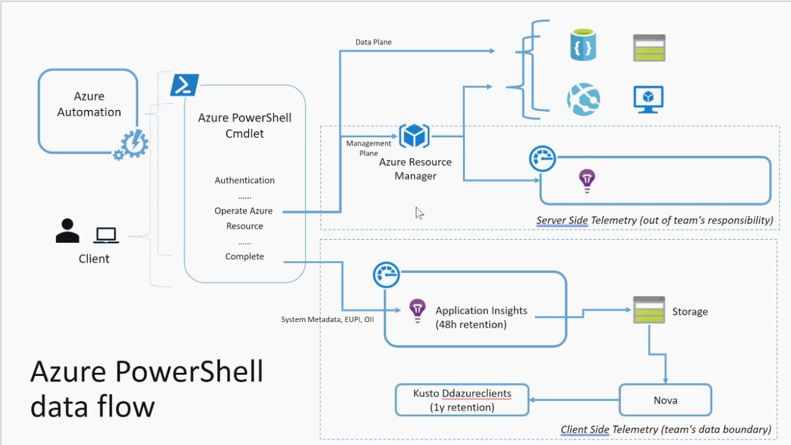

[Data explorer Cluster](https://dataexplorer.azure.com/)
[Cosmos Cluster](https://aad.cosmos14.osdinfra.net/cosmos/VisualStudio.LoadingDock/shares/VisualStudio.Nova/public/data/nova/ai.azurecli/)

database:
 - Kusto Ddazureclients 6 month -> @ddazureclients/AzureCli
 - Cosmos 3 year

Data explorer Commands:
- StormEvents (table)
- RawEventsAzCli (cli table)
- | sort by StartTime desc 
- | take 10
- | project StartTime, EndTime (table column)
- | summarize event_count=count(), mid = avg(BeginLat) by State
- | where event_count > 1800
- | where State == "xxx"
- | where State in ('A', 'B', 'C')
- | where StartTime between (datetime(2022-01-01) .. datetime(2022-01-02))
- | where StartTime == datetime(2020-01-01T00:35:00Z)
- | where userAgent contains "AzureCLI/2."    匹配CLI
- | where EventTimestamp > ago(7d/3h)         七天内
- | where Properties['issuccess'] == 'False'  失败的
- | where Properties['command'] == 'az init'  哪个命令
- | render columnchart

Knowledge base -> New-Hire Onboarding -> 07.Advanced topics -> c.CLI Telemetry