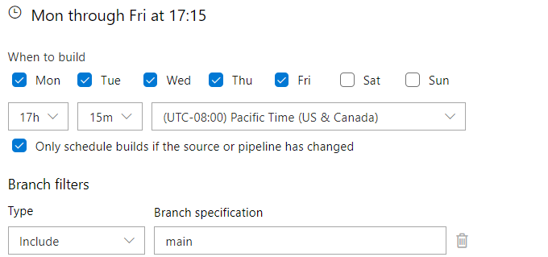

https://github.com/azclibot
https://github.com/MicrosoftDocs/azure-docs-cli/pull/3110

Feng Zhou
jiang shuang
Chen Yu

azure-cli-extension index release pr：
https://dev.azure.com/azure-sdk/internal/_apps/hub/ms.vss-ciworkflow.build-ci-hub?_a=edit-build-definition&id=1570

azure-cli-doc
https://dev.azure.com/azure-sdk/internal/_apps/hub/ms.vss-ciworkflow.build-ci-hub?_a=edit-build-definition&id=1569

只创建PR，一直如此  
时间：  

find extension upgrade: 
write extension name to ./upgrade_extensions.txt

update index.json: 
update index.json to storage
az storage blob upload -f src/index.json -c index1 -n index.json --account-name azcliextensionsync --account-key

check whether index pr exists: 
check pr title, exist abandon current build, not found continue 
- token
- upgrade_extensions.txt

build upgraded extension:
- upgrade_extensions.txt
- azdev extension build xxx (Construct a WHL file for one or more extensions.)

upload, update index.json:
- AZURE_STORAGE_ACCOUNT="azcliprod"
- AZURE_STORAGE_CONTAINER="cli-extensions"
- uploading extension wheel
- azdev extension update-index $url (Update the extensions index.json from a built WHL file.)

save changes, create PR:
- token

--------

clone forked azure-docs-cli, set remote
pip install requirements.txt
update extension list:
scripts/ci/avail-ext-doc/update_extension_list.py
save changes, create PR:
- token
